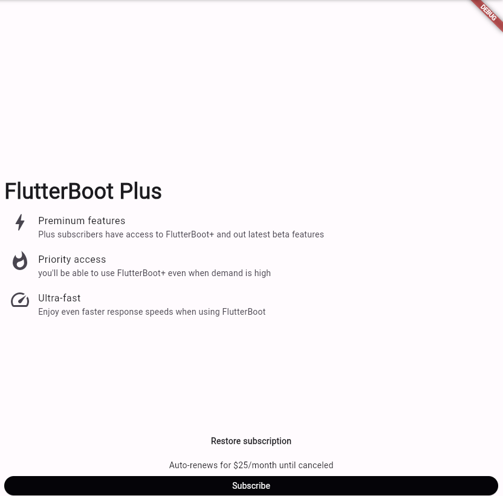

# practice_01

- 플러터 부트 1일차 - 기본 문제

  

  - 위와 같이 구현을 하며 따로 버튼에 대한 이벤트는 놓지 않는다.
  - 레이아웃 구성

- 생각했던 방식과 사용했던 주요 위젯들

  - Row, Column : 행, 열
  - ListTile : 고정 높이의 단일행의 위젯
  - 위의 위젯들을 바탕으로 전부 Column안에 위젯들을 나열한다.

- 느낀 점 

  - 중앙 정렬을 하되 칸과 칸 사이에 공백을 만들어야 했다. 중간에 Spacer()를 둔다고해서 되는 것이 아니라 제목인 FlutterBoot Plus위에에도 Spacer()를 두어 공백을 만들었다.
  - 버튼에 대해서도 Row로 만든 다음 Expanded로 Row가 가지는 너비 만큼 확장되도록 만들었다.
  - 다만, 아이콘도 상단으로 올리기 위해 Column, 버튼을 늘리기 위해 Row 위젯들을 추가한 것이 불필요한 과정이라고 느꼈다.
  - 또한, 좀 더 객체화하고 코드의 가독성을 늘리는 것에 어려움이 존재했다. 
  - 그래도 과제를 해결한 것에 의의가 크다 !

