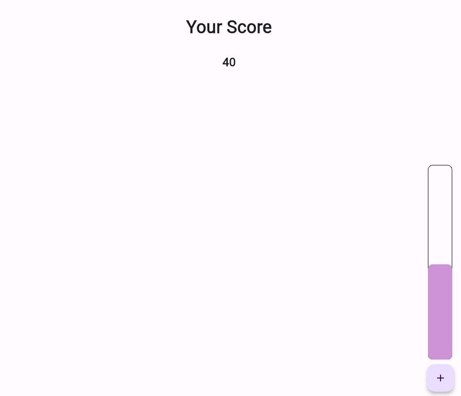

# practice_02

- 플러터 부트 2일차 - 기본 문제

- 위와 같이 레이아웃을 짜고 +버튼을 눌렀을 때 게이지가 차오르면서 해당 네모에 게이지를 완전히 채우면 카운팅을 진행한다.
- 채우는 부분에서 애니메이션으로 구현하여야 되며 내려오면 0으로 초기화를 해준다.
- 어느 부분에서 카운팅을 하고 어느 부분까지 내려오면 0으로 초기화하는 등 자유롭게 하면 되었다.

- 생각했던 방식과 사용했던 주요 위젯들
  - Stack, Positioned : Stack으로 위젯을 겹치게 만들 수 있고, Positioned로 위치를 조절
  - AnimatedContainer : 기본 Container와 동일하나 컨테이너 속성이 `변경` 될 경우 애니메이션 효과와 함께 변경
  - FloatingActionButton : 왼쪽 하단 버튼
  - 구글링을 진행하면서 Stack과 Positioned, AnimatedContainer까지는 어찌 할 수 있었으나 
  - 그 안의 animation 내용들을 구현하는 것이 어려웠다.
- 느낀 점
  - 다른 분이 작성한 코드를 토대로 이해하는 과정을 거치게 되었다.
  - 물론 여기서 끝을 내면 안되고 해당 내용을 토대로 다른 방식으로 만들면서 내 것으로 소화하도록 해야겠다.
  - 진짜 애니메이션은 모르겠다... 하지만 ! 처음이니까 화이팅해보자 
  - 심화 과정은 언제쯤 다룰 수 있으려나...ㅎ