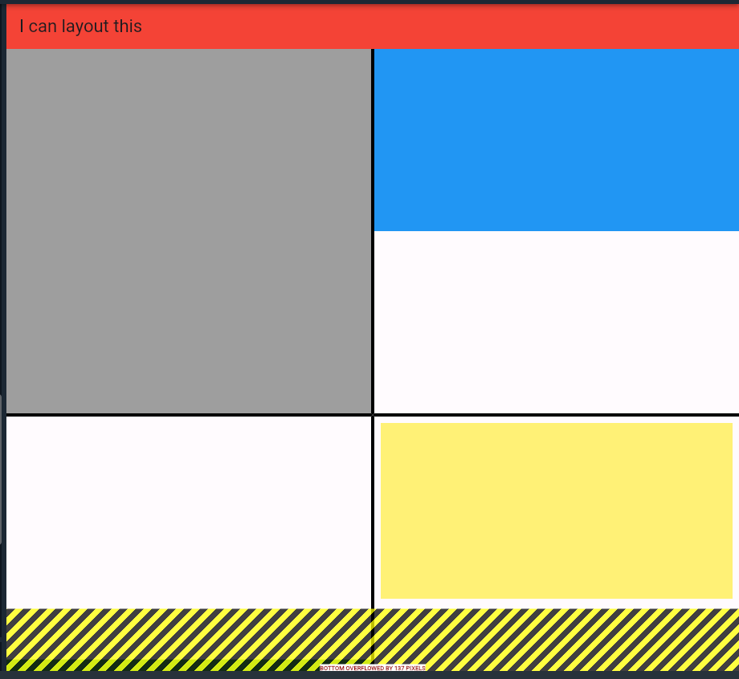

# practice_03

- 플러터 부트 3일차 - 기본 문제

- [ overflow 해결 못한 경우 - 화면 너비를 늘릴 때 ]

- 우선 레이아웃을 짜는거는 어렵지 않았으나 코드에서 보면 중복되는 부분을 못 줄였다.
- 각 사각형에 대해  각각 border에 대해 다르게 줘서 그런지 BoxDecoration이 다양하여 지저분하게 나와있다.
- 다른 방법이 있을 것 같았으나 찾아봐야 될 것 같다. 

- 느낀 점 
  - 코드를 작성하면서 그냥 레이아웃 짜는거라 이것저것 한 느낌이다.
  - 음... 그냥 짜맞추기 하면서 의미파악도 제대로 하지 못한 채 진행했달까 
  - 그러다보니 중간에 안되니까 아 이거 원리같은거를 먼저 알아야될 것 같은데 라는 생각이 들면서도 그거를 인식한 이후에도 해결 방법이 떠오를 지는 의문이였다.
  - 결과적으로는 짜맞추기 식으로 진행했던 점이 나타났던 곳은 GridView로 각 사각형에 대한 위젯들을 만들었지만, 너비가 반응형으로 넓어질 때 아래에 노란색, 갈색으로 만들어진 위젯들이 Bottom Overflow문제가 나왔다.
  - 이 부분에 대해서 구글링하고 이것저것 바꿔보면서 시간을 소비하다보니 조급해지는 면이 생김
  - 그래서 각 위젯, 속성에 대한 설명부터 제대로 읽고나서 원리를 이해하고, 구글링 하는 것이 옳다는 것을 또 느끼게 되었다.
  - 위와 같은 실수를 덜 해야 될 것 같고, 동작 원리 파악과 각 위젯과 속성에 대한 정리 및 이해, 코드 가독성 늘리는 방식으로 수정하여 올리도록 해야겠다.