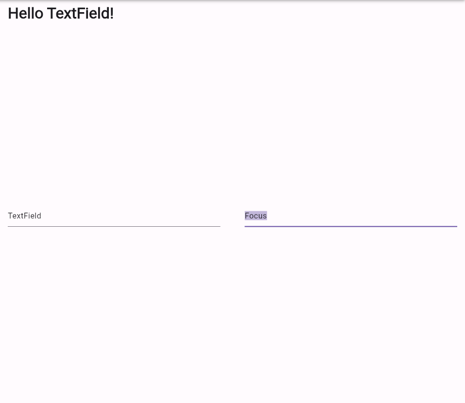

# practice_04

- 플러터 부트 4일차 - 기본 문제

- 어떻게보면 간단해 보이지만 생각보다 고려할 사항이 많았던 것 같다.
- 그리고 어떤 위젯을 써야할지 감이 안오기 때문에 이거를 찾고 찾아 나서야 한다.
- 그러다보니 검색하다가 우연찮게 이것저것하다가 맞는 경우가 있다. 
- 그래서 뭔가 좀 아쉬운 느낌이 있다. 

- 느낀 점 
  - 초반에 `RawKeyBoardListener` 로 감싸고 key Event를 판별하고자 하였다.
  - 근데 감쌌을 때 호환?이 안되는건지 씹히는 건지 자세한 이유는 모르겠지만 적용이 안되었다.
  - focus를 자동으로 잡으면 전부 selection이 되는 것 같았다. 
  - 처음에는 controller의 selection에다가 범위를 지정해서 잡고 맞은편의 textfield에다가 focus를 잡고자 하였다. 
  - 근데 이게 적용이 안되어서 어찌저찌 찾다가 `Focus` widget을 활용하게 되었다.
  - 과제의 요건은 다 맞게 한 것 같지만, 이전 과제했던 것처럼 동작 원리, 의미파악에는 아직 더디다.....
  - 따라가는 것만으로도 좋다고 해야할지 아직은 속이 답답하다

