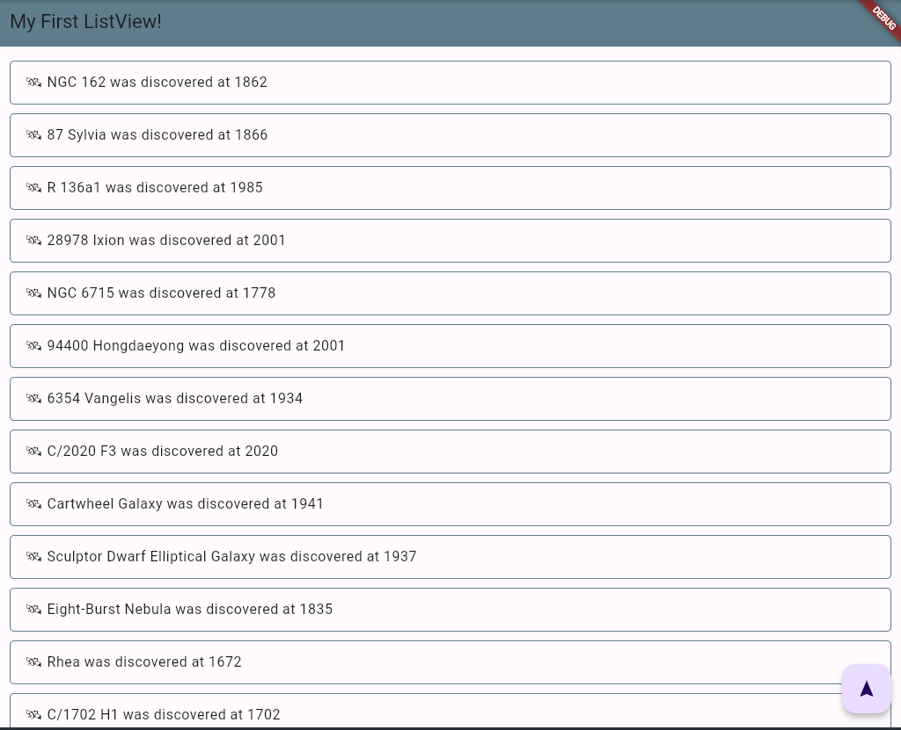

# practice_05

- 플러터 부트 5일차 - 기본 문제

- 여태까지 한 것 중 가장 할만했다고 할까? ㅋㅋㅋ 
- 키워드가 조금 주어졌기 때문에 좀 더 편했던 것 같다. 

- 느낀 점 
  - 챌린지를 진행하면서 controller에 대해서 많이 공부해야될 것 같다는 생각이 들었다. 애니메이션은 물론이거니와 텍스트필드 등 다양한 곳에서 제어하기에 사용법에 대해 익숙해져야겠다
  - 또한, flutter의 라이프사이클이랄까 기본 구동 원리에 대해서도 공부의 필요성을 느낌 
  - 생각보다 다양한 위젯들이 있기 때문에 이것 저것 많이 접해야 될 것 같음 
  - 심화도 해야되는데 아직 멀었구나...