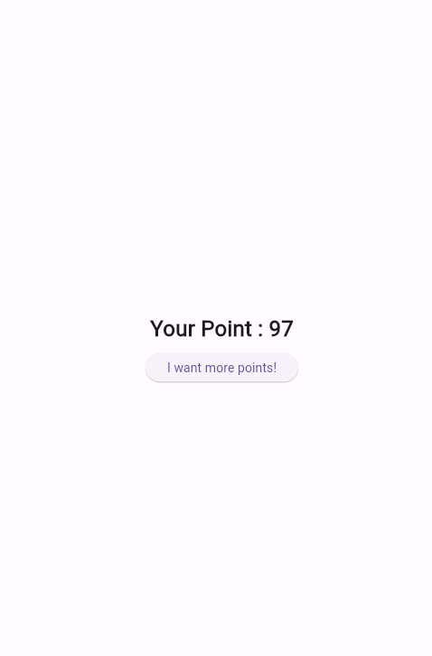
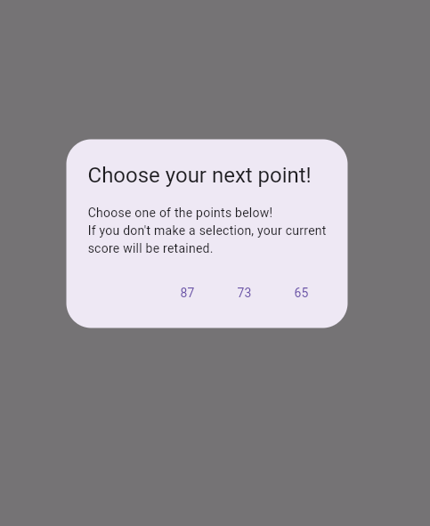

# practice_06

- 플러터 부트 6일차 - 기본 문제

- dialog를 활용해서 랜덤한 값 3개를 발생시키고 이를 선택하면 바뀌게 만드는 과제이다.

- 느낀 점
  - 했을 때는 나름 무난해서 괜찮았다. 다만, 아직 변수, 함수에 대한 위치에서 왜 안되는지에 대한 개념을 알지 못했다.
  - 즉, 기초가 없으니 기본적인 것도 못하는 꼴이랄까? 
  - 그래도 그나마 구현력이 조금 올라간 것 같아 좋으면서도 기초에 대해서 갈고 닦는 모습이 필요해 보인다.
  - 시간이 남을 때 정리하고 숙지하도록 할 것이다 !!!

