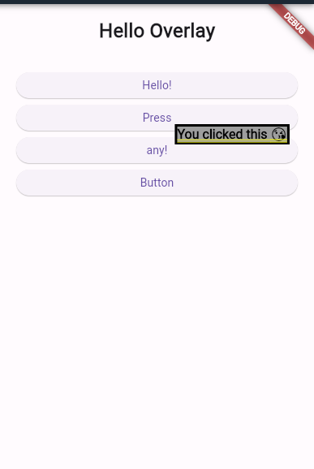

# practice_07

- 플러터 부트 7일차 - 기본 문제

- Overlay 위젯을 사용하는 것이였는데 표현하도록 하는 것은 쉬울 수 있으나 삭제하고 다른 곳에다가 클릭했을 때 처리하는 방법이 필요했음 

- 느낀 점
  - 각 위젯의 `크기, 위치` 에 따라서 임의로 계산을 하면서 위치시키도록 하였다.
  - 화면의 크기가 줄었을 때, 늘어났을 때 해당 위치로 움직이지는 않았다. 
  - 그래서 위젯의 `우상단` 에 고정시킬 수 있는 방법을 찾고싶긴한데 다른분들도 따로 값을 주면서 진행했던 것 같다.
  - 고정시킬 수 있는 방법이 있는지는 좀 더 찾아봐야겠으며 위젯 4개를 레이아웃에 다 하나씩 만들고 key값을 주는 방법에 익숙해지지 말아야겠다
  - 예를 들어 html template에다가 button tag를 10개 다 쓰는게 아니라 for문으로 따로 10개 나오도록 js로 처리한다는지 그런 방법처럼 함수화, 위젯 공통화 등을 습관화 해야겠다.