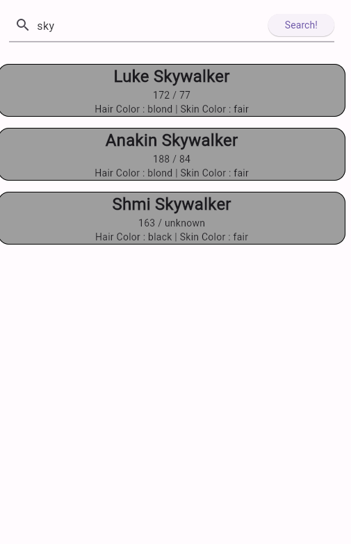

# practice_08

- 플러터 부트 8일차 - 기본 문제

- 과제를 봤을 때 ListView를 쓰면 되겠다고 생각은 했다

- 느낀 점
  - 코드를 진행할 때 `setState` 를 해서 상태에 따라 중간에 나오는 말이 달라야 했다
  - api호출했을 때 빈 값인 경우, 값이 있는 경우, 로딩 중 등에 따라 달리 보여줘야 했음
  - 그러다 보니 `setState` 는 위젯이 전체 리로딩이 되는 것으로 알고 있어서 어느정도 감안하면서 진행을 해야 되는 것으로 알고 있다.
  - 다만, 안쓸 수가 없어서 쓰기는 썼지만 조금 찝찝... 
  - 그래도 코드 가독성 좀 늘린 것 같아 그나마 낫다는 느낌?
  - User class, switch문 등...
  - json decoding하고 또 파싱하는 작업 등 그런 것도 따로 해줘야 했다 
  - 역시나 원리나 중요한 것 같구나

