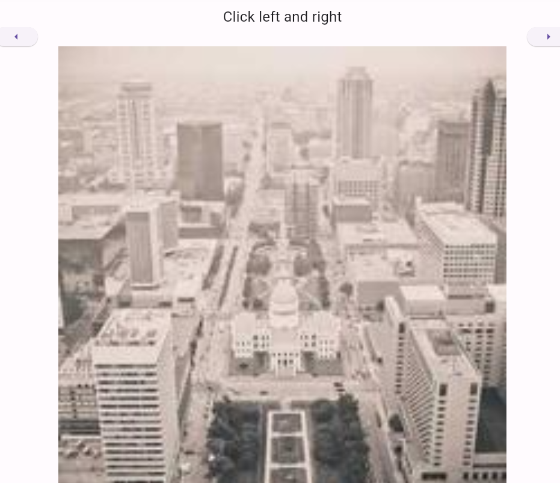

# practice_09

- 플러터 부트 9일차 - 기본 문제

- Image network를 활용하여 이미지를 표현해주는 것이었다. 

- 느낀 점 
  - 단순하게 Image.network 내 loadingBuilder를 넣어서 할 수 있는데 이름만 봐서는 loading동안 나타내는  거니까 여기서 Text(loading)하면 되겠다 
  - 위와 같이 생각해서 큰코 다쳤다. 
  - 물론 loading은 맞지만, 이미지가 어느정도까지의 로딩이 되었는지 등 계산할 수 있는 정보를 준다. 
  - 그러면 frameBuilder가 위젯이 생성될 때를 담당하는데, 이를 혼합하면 예를 들어 이미지가 로딩될 때 퍼센티지 등을 표현할 수 있다.
  - 즉, 구동원리와 각 위젯과 Builder의 속성들을 아는 것이 중요하다. 
  - 또 다른 분이 frameBuilder가 먼저 돌기 때문에 이런 내용도 숙지하면 좋을 것 같다. 
  - 이외에도 Image.network 위젯을 사용할 때 기존에 이미지들을 다시 요청하지 않고 기존에 있었던 것을 부르는 것으로 보인다. 
  - frameBuilder를 살펴보고, 이에 대한 내용은 다른 분들 께 물어보고 있다. 
  - 10일차에  끝인데 이후에는 좀 구동원리좀 잘 알아보자...