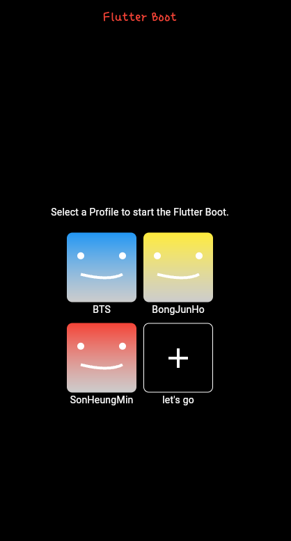

# practice_10

- 플러터 부트 10일차 - 기본 문제

- 힌트는 customPaint를 활용하는 것이였다. 

- 느낀 점

  - 와 생각보다 어려웠다.
  - 저 웃는 표시에서 그려주는 것이 내 맘대로 되지 않는 것 
  - 곡선으로 그려줘서 좌표값을 정해줘서 하긴 하는데 이해가 덜 된건지 뭔가 이것저것 하다가 된 느낌이다. 
  - 사실 저 linearGradient도 생각보다 맘에 들지는 않는다. 
  - 다른 방법으로 시도하거나 좀 더 알아보고 opacity를 좀 어떻게 했어야 됐는데 그 부분에서는 조금 아쉽..?다기 보다는 덜 적극적이지 않았나 싶다 지금 보니.. 

  - 역시나 디자인하는 거는 꽤 어렵다고 느끼긴 했다
  - 항상  css나 디자인 하는 것에서 조금 어려움을 느꼈다
  - 그래도 막상 해보니까 더 잘해지고 싶다는 마음도 들기도 한다 
  - 과제들을 진행하면서 보완할 부분, 지식, 개념, 원리 등을 정리하고 내가 만들고 싶은 사이드 프로젝트를 진행해보도록 해야겠다.

